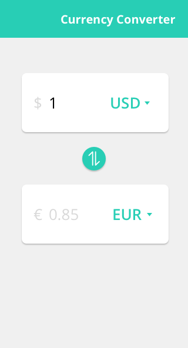
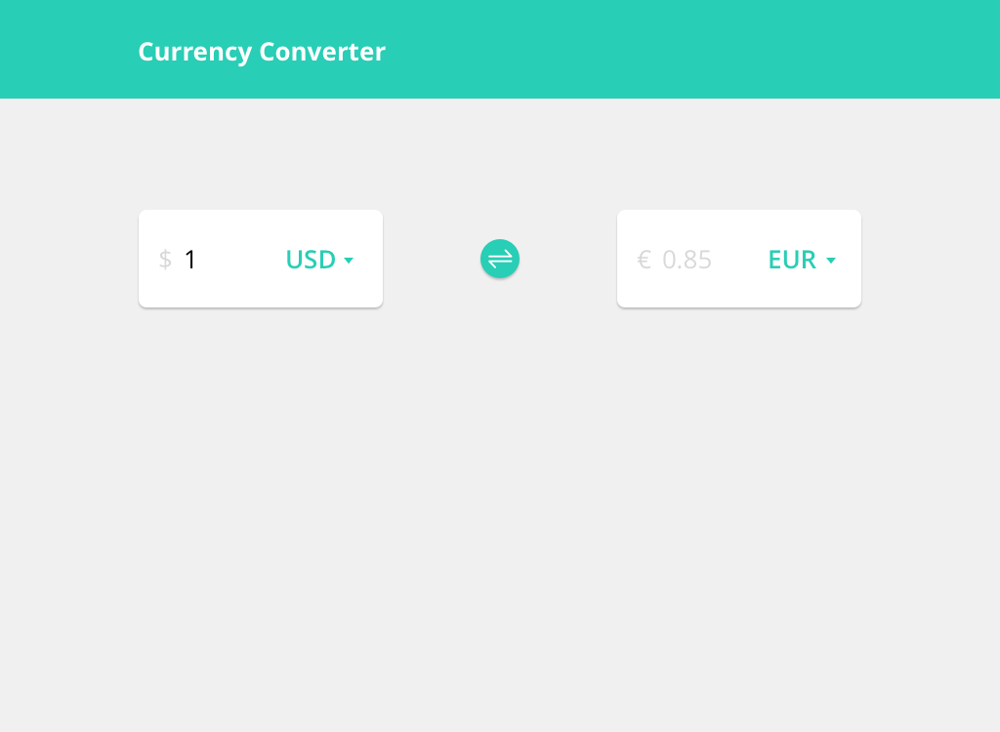

  

# <a href="https://metaory.github.io/meta-vanilla-web-component/" target="_blank">Live Demo</a>
---

# Frontend Developer Task

- Your task is to implement a basic currency converter which converts values between Euro, US Dollar and Japanese Yen. Use [fixer.io](https://fixer.io/) API endpoints to get the latest exchange rates.
- The provided HTML markup is not very elaborate and is just a starting point. Improve and extend it, and apply best practices.
- Do not use any post- or pre-processors for your styles, and do not use any styling libraries like Bootstrap or Foundation.
- In your JavaScript, do not use any libraries or frameworks like jQuery, Angular, React, etc.
- As the solution must only work on the latest Chrome version, you can make use of ES6 features and new CSS technologies without thinking about transpiling or vendor-prefixing them. Of course, you do not have to use fancy new features, but it would be a plus.
- Below are two design mock-ups for the applicaton: one for mobile devices and another for desktop. Match the design as close as possible.
- Further notes:
	- The application should convert the entered amount on the fly, using the conversion rates retrieved from the API.
	- By hitting the  button, the user can swap selected source and target currency. You find the sybmol used in the mockup in the `assets` folder (`switch.svg`).

## Bonus
- Show a history of conversion inputs.
- Keep the history persistent on browser reload.

---

### Mobile

### Desktop

